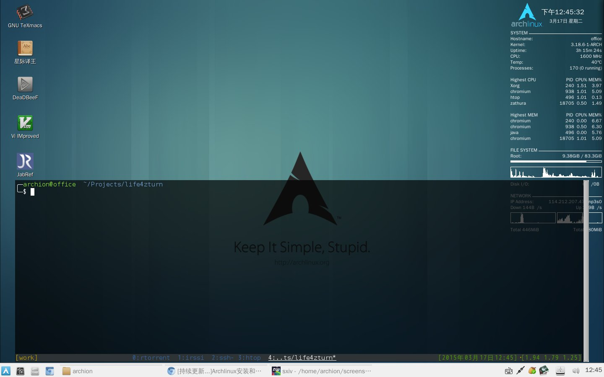

+++
title = "[持续更新...]Archlinux安装和配置"
date = 2014-02-06T18:46:26Z
tags = ["linux", "配置"]
[extra]
mdate = "2016-02-05T21:20:33Z"
+++



想给家里的老台式机也装个Arch，顺便记录下，效果如题图
<!-- more -->

## Archlinux的简易安装步骤

- 用dd制作Archlinux的u盘启动盘
- 配置网络
- 分区
- 设置分区文件系统
- 挂载分区
- 配置pacman的镜像
- 安装arch基本系统
- 生成分区表fstab
- chroot转到新安装的系统
- 配置新系统的Locale，时区和时间
- 配置网络
- 设置root密码
- 安装启动加载器grub
- 退出账户，取消挂载，重启
- 配置网络
- 添加账户并设置密码
- 安装字体，声音系统，显卡驱动和xorg

详细步骤参考[官方wiki新手入门](https://wiki.archlinux.org/index.php/Beginners%27_Guide)

## 安装软件

### 基本桌面环境
- `sudo`
- `yaourt`：包管理器
~~ - `ccsm compiz-core emerald emerald-themes compiz-fusion-plugins-main compiz-fusion-plugins-extra | openbox xcompmgr `：窗口管理器  ~~
~~不知是显卡比较老的缘故还是其他原因，compiz启动不了，只好用openbox作为替代，需要安装xcompmgr以提供透明效果~~ 最近更新了显卡驱动，可以用了
- `compiz emerald0.9 emerald-themes`：窗口管理器 (compiz 0.9.x)
- `ntp`：同步网络时间
- `lightdm lightdm-gtk-greeter`：登录管理器
- ~~`razor-qt`：桌面环境~~
- `lxqt`：桌面环境（除了pcmanfm-qt，桌面由pcmanfm提供）
- `acpid`

### 常用软件
- `tilda`：终端
- `openssh`
- `zsh`
- `git`：版本管理
- `tmux`：终端复用
- `rtorrent`：下载软件
- `conky`：信息桌面显示
- `fcitx-im`：输入法
- `pcmanfm gvfs`：文件管理器
- ~~`gpicview`：图片浏览器~~
- `sxiv`：图片浏览器
- `synapse`：快速程序启动器
- `gvim`：文本编辑器
- ~~`mplayer`：视频播发器~~
- `mpv`：视频播发器
- `chromium`：网页浏览器
- ~~`zathura zathura-ps`：eps阅读器~~
- `gv`：eps阅读器
- `llpp`：pdf阅读器
- `deadbeef`：音乐播放器
- ~~`jabref`：文献管理~~
- `zotero`：文献管理
- `nutstore`：坚果云
- `network-manager-applet gnome-keyring`：网络链接管理
- `texlive-core texlive-latexextra texlive-langcjk texlive-publishers`：LaTeX
- `intel-fortran-compiler`：ifort

### 一些主题
- `oxygen-xcursors`
- `gtk-engines gtk-engine-murrine gtk-engine-unico zukitwo-themes faience-icon-theme faenza-icon-theme`

## 配置
- `ssh`：[启动服务](https://wiki.archlinux.org/index.php/Secure_Shell#Daemon)并[配置密钥](https://wiki.archlinux.org/index.php/SSH_Keys#Simple_method)
- `zsh`：[oh-my-zsh](https://github.com/robbyrussell/oh-my-zsh)
- `sudo`：[允许wheel执行sudo](https://wiki.archlinux.org/index.php/sudo#Example_Entries)，[传递环境变量](https://wiki.archlinux.org/index.php/sudo#Environment_variables)，[传递别名](https://wiki.archlinux.org/index.php/sudo#Passing_aliases)
- `lightdm`：[启动自动登录](https://wiki.archlinux.org/index.php/LightDM#Enabling_Autologin)、[启动小键盘](https://wiki.archlinux.org/index.php/LightDM#NumLock_ON)（最好同时加`上session-setup-script=/usr/bin/numlockx on`）和设置主题：`/etc/lightdm/lightdm-gtk-greeter.conf`
- `grub`：[记住上次选择的系统](https://wiki.archlinux.org/index.php/GRUB#Recall_previous_entry)，编辑后执行`sudo grub-mkconfig -o /boot/grub/grub.cfg`
- 支持休眠：编辑[grub](https://wiki.archlinux.org/index.php/Suspend_and_Hibernate#Required_kernel_parameters)和[mkinicpio.conf](https://wiki.archlinux.org/index.php/Suspend_and_Hibernate#Recreate_initial_ramdisk)
- [无密码挂载本地磁盘](https://wiki.archlinux.org/index.php/Polkit#Allow_mounting_a_filesystem_on_a_system_device_for_any_user)
- `NetworkManager`：[停用并禁止其他网络服务](https://wiki.archlinux.org/index.php/NetworkManager#Base_install)（一般为`dhcpcd.service`），[启动](https://wiki.archlinux.org/index.php/NetworkManager#Enable_NetworkManager)`NetworkManager.service`
- `pluseaudio`：[支持只支持`ALSA`的应用](https://wiki.archlinux.org/index.php/PulseAudio#ALSA)
- `sxiv`：~~[修改config.h中的GIF_LOOP变量值为1](https://github.com/muennich/sxiv/issues/101)以支持gif无限循环~~ 新版支持`-a`选项
- 一些软件的家目录[配置](https://github.com/archion/mylinux)
	- vim
	- zsh
	- mplayer
	- zathura
	- razor-qt
	- compiz
	- tmux
	- rtorrent
	- conky
	- emerald themes settings
	- deadbeef
	- tilda
	- gtk and qt themes settings
	- xwindow file settings
	- and defaults app settings

## 一些问题

- `pcmanfm`左边栏没有本地磁盘图标  
描述：因为用的是`LightDM`，所以在`.xprofile`加入`exec razor-session`以启动`razor-qt`，结果发现`pcmanfm`左边栏本地磁盘图标消失，在终端以`dbus-launch pcmanfm`运行则会出现  
解决方案：在`.xprofile`中移除`exec razor-session`，对于`LightDM`来说移除后也可启动razor-qt环境，对于`SLiM`，貌似不行

- ~~`razor-qt`无法识别compiz~~ 改用LXQt，已支持`compiz ccp`  
描述：启动后要求手动选择窗口管理器，但没有`compiz`选项  
解决方案：  
首先在`~/.config/razor/windowmanagers.conf`中添加对compiz的支持
	```bash ~/.config/razor/windowmanagers.conf
[KnownManagers]
compiz/Name=Compiz
compiz/Comment=OpenGL compositing window manager
	```
	然后让razor-qt启动compiz：
	```bash ~/.config/razor/session.conf 
[General]
windowmanager=compiz 
	```
	这样作是无法让compiz读取用户自定义的设置的，但是如果按照[Arch wiki](https://wiki.archlinux.org/index.php/Razor-qt#Compiz)的做法又会有问题，所以折中的方法是在启动后在razor-qt开机自启动里设置`compiz --replace ccp`
- java程序的字体反锯齿:  
描述：~~对于`OpenJDK`，~~ 按照[Arch wiki](https://wiki.archlinux.org/index.php/Java_Runtime_Environment_Fonts#Anti-aliasing)的做法无法开启反锯齿  
原因：因为图形界面属于login shell，而在图形界面启动的终端是nologin shell，这两者在读取初始配置文件是有差别  
解决方案：~~还没找到，不过发现从终端启动java程序会有反锯齿效果~~ 将命令添加到`/etc/profile`

- zip文件解压乱码:  
描述：在windows上压缩的文件，是以系统默认编码中文来压缩文件。由于zip文件中没有声明其编码，所以linux上的unzip一般以默认编码解压，中文文件名会出现乱码。    
解决方案：原先unzip支持`-O`选项来指定编码，现在没有了，可以安装AUR里的unzip-iconv来提供该选项，安装完后解压命令为`unzip -O CP936 XXX.zip`
