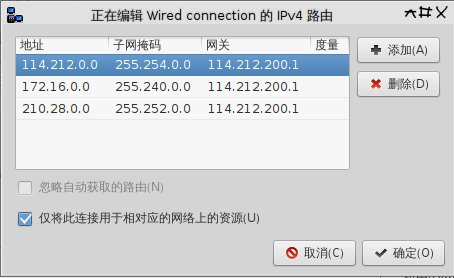

+++
title = "双网络的路由设置"
date = 2016-01-03T15:12:27Z
tags = ["网络"]
[extra]
mdate = "2016-02-05T19:21:35Z"
+++

现在电脑有两个网卡，一个有线网卡和一个无线网卡，现在希望实现内网流量走有线网卡（速度快），外网流量走无线网卡（蹭网）
<!-- more -->

上述功能可以用设置路由来实现，所谓路由就是给网络传输提供一个向导，让其知道下一个传输点的位置

首先，我们需要确定默认网卡，因为除内网外所有流量都走无线网卡，所以设置默认网卡为无线网卡是方便的

其次，制定规则，设置所有内网的ip段（内网的ip段分别为`114.212.0.0/15`,`172.16.0.0/12`,`210.28.0.0/14`）都走有线网卡，并设置相应的网关

`route`命令是用来手动设置路由的，原本的路由是这样的（执行`route -n` 输出的结果）

```
Kernel IP routing table
Destination     Gateway         Genmask         Flags Metric Ref    Use Iface
0.0.0.0         114.212.200.1   0.0.0.0         UG    100    0        0 enp3s0
0.0.0.0         192.168.1.1     0.0.0.0         UG    600    0        0 wlp0s26f7u5
114.212.200.0   0.0.0.0         255.255.248.0   U     100    0        0 enp3s0
192.168.1.0     0.0.0.0         255.255.255.0   U     600    0        0 wlp0s26f7u5
```

其中有线网卡的接口为`enp3s0`，无线网卡的接口为`wlp0s26f7u5`，我们需要将路由变为如下情况

```
Kernel IP routing table
Destination     Gateway         Genmask         Flags Metric Ref    Use Iface
0.0.0.0         192.168.1.1     0.0.0.0         UG    600    0        0 wlp0s26f7u5
114.212.0.0     114.212.200.1   255.254.0.0     UG    100    0        0 enp3s0
114.212.200.0   0.0.0.0         255.255.248.0   U     100    0        0 enp3s0
172.16.0.0      114.212.200.1   255.240.0.0     UG    100    0        0 enp3s0
192.168.1.0     0.0.0.0         255.255.255.0   U     600    0        0 wlp0s26f7u5
210.28.0.0      114.212.200.1   255.252.0.0     UG    100    0        0 enp3s0
```

即把`enp3s0`网卡的默认路由`0.0.0.0`删除，并添加三条内网的路由规则到`enp3s0`网卡上，网关为`114.212.200.1`，命令如下

```
# route del -net 0.0.0.0 gw 114.212.200.1 enp3s0
# route add -net 114.212.0.0/15 gw 114.212.200.1 enp3s0
# route add -net 172.16.0.0/12 gw 114.212.200.1 enp3s0
# route add -net 210.28.0.0/14 gw 114.212.200.1 enp3s0
```

# 优先级

上述路由在没有无线网卡的时候会上不了网，原因是删除了有线网卡的默认路由`0.0.0.0`，更好的方法是不删除而是改变Metric值来改变路由的优先级，因为`route`命令没有修改的命令，所以只有先`route del`后再`route add ... metric ...`，这里我选择减低无线网卡的Metric值来提高它的优先级，最后的命令是

```
# route del -net 0.0.0.0 gw 192.168.1.1 wlp0s26f7u5
# route add -net 0.0.0.0/0 gw 192.168.1.1 metric 50 wlp0s26f7u5
# route add -net 114.212.0.0/15 gw 114.212.200.1 enp3s0
# route add -net 172.16.0.0/12 gw 114.212.200.1 enp3s0
# route add -net 210.28.0.0/14 gw 114.212.200.1 enp3s0
```
得到的路由表为

```
Kernel IP routing table
Destination     Gateway         Genmask         Flags Metric Ref    Use Iface
0.0.0.0         192.168.1.1     0.0.0.0         UG     50    0        0 wlp0s26f7u5
0.0.0.0         114.212.200.1   0.0.0.0         UG    100    0        0 enp3s0
114.212.0.0     114.212.200.1   255.254.0.0     UG    100    0        0 enp3s0
114.212.200.0   0.0.0.0         255.255.248.0   U     100    0        0 enp3s0
172.16.0.0      114.212.200.1   255.240.0.0     UG    100    0        0 enp3s0
192.168.1.0     0.0.0.0         255.255.255.0   U     600    0        0 wlp0s26f7u5
210.28.0.0      114.212.200.1   255.252.0.0     UG    100    0        0 enp3s0
```

# 永久生效

上述设置在重启网络后就会失效，如果想要永久有效的话，可以将设置添加到网络管理程序中，我用的网络管理程序是 NetworkManager ，可以在它的有线网卡设置中直接添加，如下（注意下面有个勾是用来取消默认网卡的）



如果选择设置路由的优先级，图形设置界面好像不行，可以用NetworkManager 的命令行工具`nmcli`来改变接口默认的Metric值（具体参考[Changing NetworkManager route metrics](http://blog.felipe.lessa.nom.br/?p=129)），或者可以直接修改对应`/etc/NetworkManager/system-connections`目录下的配置文件，在对应区域（如`[ipv4]`）添加`route-metric=50`行（可能需要重启 NetworkManager ）
