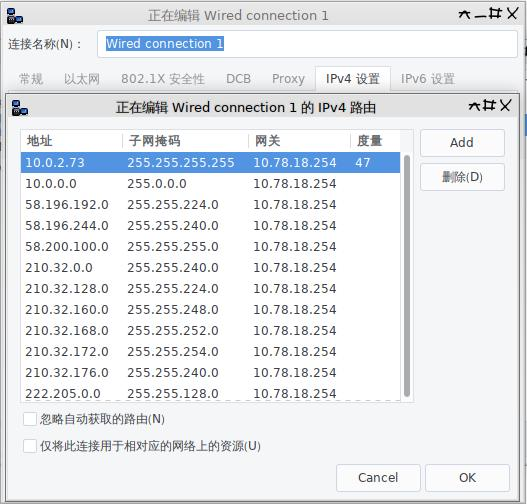

+++
title = "浙大有线网络上网"
date = 2018-03-01T13:33:47Z
tags = ["网络"]
[extra]
mdate = "2018-03-31T08:07:24Z"
+++

初来浙大紫荆港，办公室内电脑有线网络通过用[zjunet](https://github.com/QSCTech/zjunet)连VPN后可以上网，不过下载文件只有前两三秒有速度，访问网页也是有些网站内容显示不全，在线看视频听歌也会断，而且即使不连网，从内网服务器上rsync也有类似问题。网络中心的人过来用他们的usb网卡测试问题依旧，所以可以排除网卡问题，电脑通过usb连接android手机通过学校的无线网络上网则一切正常，很是奇怪。。。
<!-- more -->

在cc98上搜了些帖子和网络中心对Mac OS上VPN的配置指导，大致了解了下浙大的上网环境，于是尝试不借助zjunet而是自己手动配置网络，结果问题就消失了。。

本质上说，浙大的上网方式就是xl2tp类型的VPN，不过由于连上VPN后就不能上内网了，而VPN服务器（lns.zju.edu.cn）又是在内网，所以连上VPN后由于不能访问VPN服务器而导致上不了网，并且1分钟后VPN服务器会判断用户下线而断开VPN连接。所以要想上网，有两个条件，第一，可以ping通lns.zju.edu.cn(10.0.2.73)，如果连接不上则需要配置网卡的路由表，其次是连上VPN后仍然ping通lns.zju.edu.cn，这也需要配置路由表，因为一般连上VPN后所有流量都是走VPN的。

所以需要作的事情有两个
- 是设置网卡的静态路由，并额外添加一条VPN服务器的路由，设置小metric以便优先使用。
- 通过xl2tp连接学校的VPN。

这两个步骤可以用命令行完成也可以用图形界面完成，由于NetworkManager支持xl2tp的VPN连接，所以在networkmanager里设置静态路由和VPN是非常方便的，而且都不需要借助额外的软件或者脚本。

路由表参考zjunet的代码：

```bash
#内网网段
10.0.2.72 #VPN服务器lns.zju.edu.cn的IP，需要设置较小的metric值，以便使其优先级高于VPN连接自动设置的路由表
10.0.0.0/8
58.196.192.0/19
58.196.224.0/20
58.200.100.0/24
210.32.0.0/20
210.32.128.0/19
210.32.160.0/21
210.32.168.0/22
210.32.172.0/23
210.32.176.0/20
222.205.0.0/17
```

比如我的NetworkManager的有线连接路由表为：



并且无需设置VPN的路由表。

虽然到最后也没明白为什么最开始会出问题，不过无所谓了。最后还是要吐槽下浙大的上网方式的，南京大学可是几年前就实现了有线无限统一用网页登陆认证了。

参考：
- [浙大紫金港宿舍Linux上网详解](http://www.cc98.org/topic/3938990/1#1)
- [浙江大学网络中心Mac OS VPN设置方法](http://zuits.zju.edu.cn/_upload/article/files/f3/4f/c651caee4321bbc6b559686fd46b/cc7fab05-3aff-4512-90bb-f876a263b004.docx)


